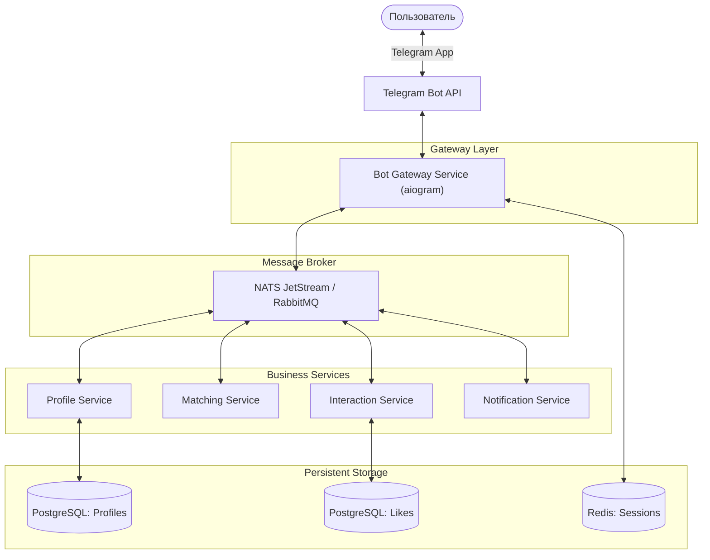

# Архитектура и схема дизайна (Микросервисы)

Проект строится на базе **микросервисной архитектуры** с использованием событийной модели (Event-Driven Architecture).

## Схема дизайна системы (High-Level Design)

### Основные принципы:
1. **Асинхронность**: Большинство операций (лайки, уведомления) обрабатываются через очередь сообщений.
2. **Изоляция данных**: Каждый сервис владеет своими данными (собственные базы данных или схемы).
3. **Масштабируемость**: Каждый микросервис может масштабироваться независимо в Docker/K8s.
4. **Отказоустойчивость**: Если сервис уведомлений временно недоступен, сообщение сохранится в брокере и будет доставлено позже.
