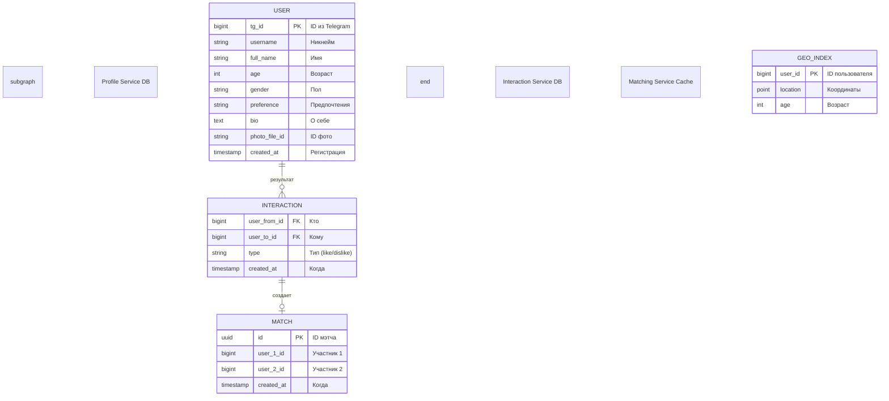

# Схема данных в БД (Микросервисы)

В микросервисной архитектуре каждый сервис владеет своей схемой данных для обеспечения независимости и масштабируемости.

## ER-диаграмма (Распределенная)

### Разделение ответственности:
1. **Profile DB**: Хранит только персональные данные. Другие сервисы получают их по запросу или через события.
2. **Interaction DB**: Хранит историю лайков и мэтчей. Не зависит от изменений в профиле.
3. **Matching Cache**: Оптимизированное хранилище (Redis или отдельная таблица в PostgreSQL с PostGIS) для быстрого гео-поиска.
4. **Notification Queue**: (Не БД) Хранит временные сообщения в Message Broker.
